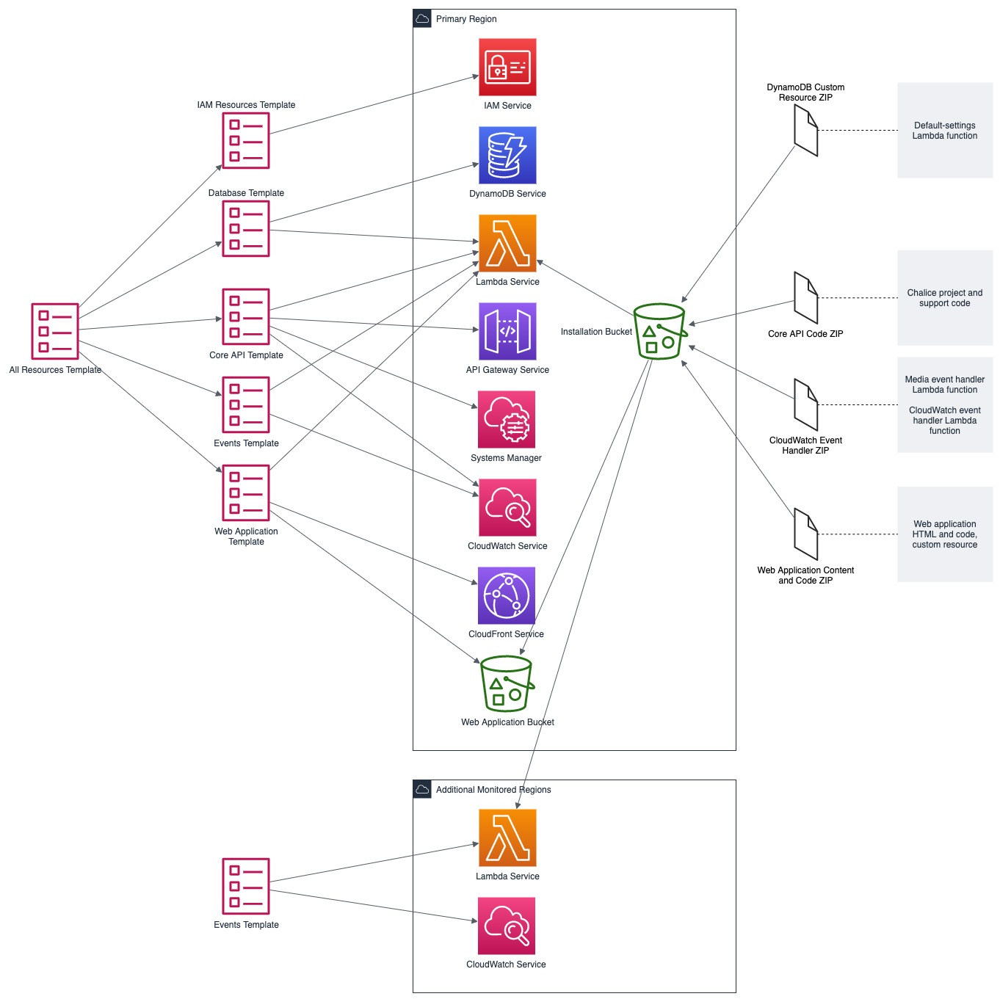
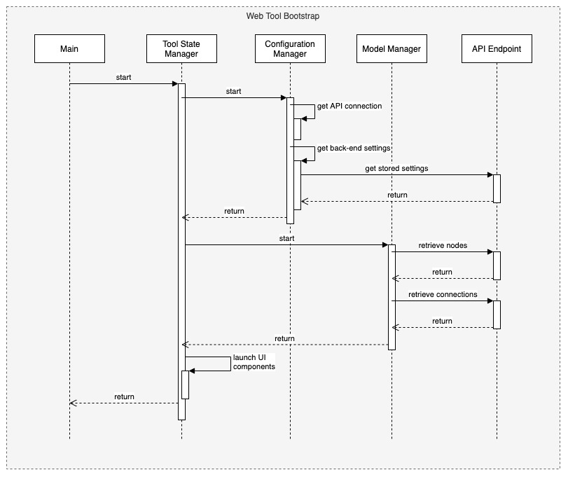
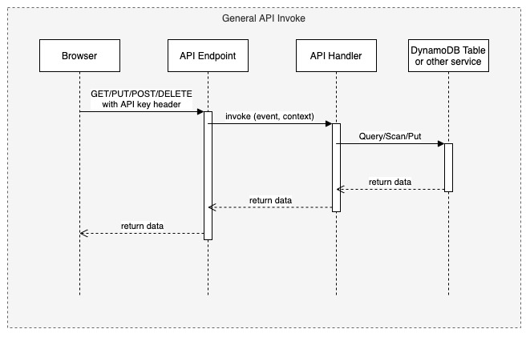
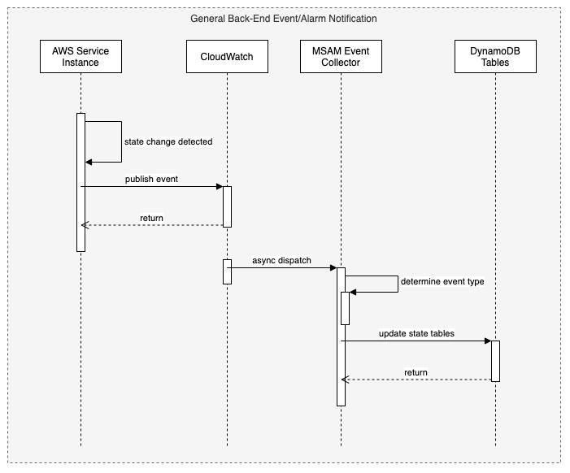
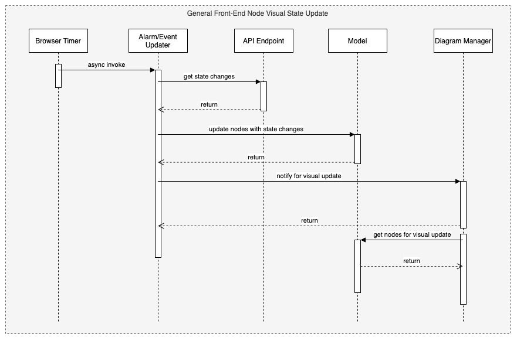

# MSAM Software Architecture Views

## Views

This document describes the architectural views for the Media Services Application Manager (MSAM) tool.

The views used in this document are:

1. use case view
2. logical view (E-R, types)
3. deployment view (deployment artifacts to services)
4. physical view (deployed code, configured services, communication paths)
5. behavioral views (sequence diagrams)

### Use Case View

#### Actors and Use Cases

**Actor: Administrator**

*Use Case: Create Tool Stack*

1. The actor locates the required URLs for the MSAM CloudFormation templates
2. The actor decides which region in which to install the new stack
3. The actor launches the all-resources template to create a new MSAM stack in the chosen region

Postconditions: The stack is created

*Use Case: Update Tool Stack*

1. The actor locates the required URLs for the MSAM CloudFormation templates
2. The actor locates the existing stack in CloudFormation
3. The actor uses the all-resources template to update the MSAM stack in the chosen region

Postconditions: The stack is updated

*Use Case: Delete Tool Stack*

2. The actor locates the existing stack in CloudFormation
3. The actor chooses to delete the stack from the region

Postconditions: The stack is deleted

**Actor: Browser Scheduler**

*Use Case: Update Notification State*

Preconditions: The use case starts when the specified timer interval has elapsed for an update

1. The visual tool contacts the API endpoint and requests changes to node alerts
2. The system returns a list of changed node IDs and their new alert status
3. The visual tool updates any tiles and diagrams' nodes with new visual status
1. The visual tool contacts the API endpoint and requests changes to node alarms
2. The system returns a list of changed node IDs and their new alarm status
3. The visual tool updates any tiles and diagrams' nodes with new visual status

Postconditions: All tiles and diagrams reflect the lastest alert and alarm status

**Actor: CloudWatch Events**

*Use Case: Update CloudWatch Event Status*

Preconditions: The use case starts when a cloud resource publishes a new event to CloudWatch

1. CloudWatch invokes the MSAM Lambda function subscribed to this event pattern with the event data
2. The function determines what type of event was received
3. The function wraps the event data with any additional context data
4. The function updates the database tables with the new event data

Postconditions: The MSAM event tracking tables are consistent with tracked resources' current state

*Use Case: Update CloudWatch Alarm Status*

Preconditions: The use case starts when a CloudWatch alarm changes state

1. CloudWatch emits an event for the change in alarm state
2. CloudWatch invokes the MSAM Lambda function subscribed to this event pattern with the event data
3. The function determines what type of event was received
4. The function wraps the alarm data with any additional context data
5. The function updates the database tables with the new alarm state data

Postconditions: The MSAM alarm tracking tables are consistent with tracked alarms' current state

**Actor: CloudWatch Scheduler**

*Use Case: Update Node Inventory*

Preconditions: The use case starts when a CloudWatch scheduled rule is triggered to launch the MSAM update node inventory Lambda function

1. The function determines the next region out of the chosen regions to inventory
2. The function determines the services for which to update inventory
3. The function contacts each service for the region to receive a list of node types (a service may provide multiple types of nodes)
4. The function merges the node data into the MSAM node inventory table

Postconditions: The MSAM node inventory for the region is updated

*Use Case: Update Connection Inventory*

Preconditions: The use case starts when a CloudWatch scheduled rule is triggered to launch the MSAM update connection inventory Lambda function

1. The function enumerates each of the connection mapping strategies
2. The function iterates through each connection mapping strategy
   1. The strategy retrieves nodes from the inventory table for the ends of the connection
   2. The strategy determines which new connections can be represented
   3. The strategy saves new and updates connections for this strategy to the inventory table

Postconditions: The MSAM connection inventory is updated

**Actor: DynamoDB Scheduler**

*Use Case: Expire Content Records*

*Use Case: Expire Event Records*

**Actor: Operator**

*Use Case: Connect to API*

Preconditions: The actor has the endpoint URL and API key for the MSAM back-end

1. The actor opens their browser and navigates to the MSAM web tool address
2. The web tool prompts the actor for a new endpoint URL and API key to connect to the back-end
3. The actor provides the information and submits the response
4. The back-end verifies the access information and the web tool continues loading

Alternative during runtime:

1. The actor chooses to change the back-end instance using the web tool menus
2. The web tool prompts the actor for a new endpoint URL and API key to connect to the back-end
3. The actor provides the information and submits the response
4. The back-end verifies the access information
5. The web tool prompts the actors to reload the web tool using the new back-end connection

*Use Case: Visualize Resources*

Diagrams:
1. The actor creates a new diagram using the tool controls
2. The actor uses the inventory browser to find and select nodes to place on the diagram
3. The actor uses the layout tools to arrange the diagram so it is understandable for the problem domain

Tiles:
1. The actor may choose to select diagram nodes to prepopulate the new tile
1. The actor uses the tool controls to create a new tile
2. The actor provides a name for the tile

*Use Case: Connect Alarms to Nodes*

Preconditions: a diagram with contents is shown

1. The actor chooses one or more nodes on the diagram
2. The actor uses the alarm tools to show the available CloudWatch Alarms
3. The actor may filter the list using sorts, keywords
4. The actor chooses one or more Alarms to associate to the selected nodes
5. The actor saves and closes the alarm tools

*Use Case: Search for Resources*

1. The actor enters criteria into the search field and initiate the search
2. The search results compartment displays
3. Tool inventory and diagram elements that match are displayed in the search results
4. The actor may select one of the nodes, diagrams or tiles in the results to navigate to it

*Use Case: Inspect Resources*

1. The actor select with the mouse a diagram node or tile
2. The compartment to display details is opened
3. The compartment is populated with configuration data about the selected item

*Use Case: Navigate to AWS Console*

### Logical View

The elements in this view represent the types (and terminology) of the problem space.

#### Alertable

This type represents a kind of node that can react and visualize Media Services alerts, which is a  type of CloudWatch Event that represents a problem or occurance with a start and end. Alertables have a consistent alert ID and state, which can be used to track the alert over time.

#### API Endpoint

This type represents an instance of the MSAM back-end with a unique inventory, diagrams, tiles, settings, and alarm subscriptions.

#### CloudWatch Alarm

This type represents a CloudWatch Alarm. An alarm has associations with zero or more nodes and has an alarm state (OK, ALARM, etc.). The state of the alarm is reflected visually on all associated nodes.

#### Diagram

This type represents a diagram displayed by the tool. A diagram has associations to each resource node it displays and the resource connections shown between each resource node. A diagram is associated to a single layout, which contains a collection of node IDs and logical coordinates of where the node was last positioned. A diagram has an alert status, which is reflected along the header of the diagram. Any node contained by the diagram in alert or alarm state will also cause the diagram to show an alert status.

#### Layout

This type represents the layout of a collection of nodes on a logical diagram surface. A layout is associated with one diagram, and contains the IDs and coordinates of each node within the diagram. The layout is restored when the diagram is shown.

#### MediaConnect Resource

This type represents a MediaConnect node, which is a type of node that can receive and display alert conditions. The alert conditions are unique to MediaConnect and that requires a specific type to handle the specializations.

#### MediaLive Resource

This type represents a MediaLive resource node, which can be a channel or multiplex. These nodes can receive and display alert conditions. The alert conditions are unique to MediaLive and that requires a specific type to handle the specializations.

#### Pipeline Alert

This type represents an alert with state that is related to an Alertable node.

#### Resource Connection

This type represents a logical connection between two cloud resources. The connection can take a number of potential forms, including a URL, an ARN or an ID number that relates one cloud resource to another.

#### Resource Node

This type represents a cloud resource, such as an S3 bucket, MediaLive channel, CloudFront distribution or many other possibilities. A resource node carries with it the basic configuration data that would be provided with a list or describe call to it's hosting AWS API.

#### Tile

This type represents a tile displayed in the tile view. A tile represents a set of resource nodes as a single entity. A tile aggregates the alarms and alerts for each resource node into a single element. It also aggregates the configuration data for each related node into a single set.

#### Tile View

This type represents the view of all tiles defined in the system. The tile view contains all the tiles know to the system. the tile view is sorted first by total number of alarms and alerts across all contained nodes, and then by tile name. This sort strategy causes the tiles with the highest number of problems to move to the top of the tile view. The tile view has an overall alert status shown in its header if any of the tiles contained by the tile view is in an alert or alarm state. 

#### Visual Overlay

This type represents a special informational overlay that can be added to any node type. The visual overlay allows for custom information to be shown on the body of the node in the diagram. The visual overlay is used to display configuration inforamtion, or alert or alarm status. The default overlay for all nodes shows the alarm status of the node.

### Deployment View

The deployment view shows the relationships between the deployment units (installers, binaries, CloudFormation templates) and the target services that receive the deployment configuration or run deployed code. 

The previous diagram shows at the left the All Resources Template, its relationship to specific templates for different layers of the solution. The center of the diagram shows the AWS cloud services that receive the configuration or code deployed by the separate templates. In cases of Lambda function deployment, a hosted bucket in each supported region contains the official builds of the code and content for MSAM. The provided templates access the archives from these buckets during deployment. At the right side of the diagram are the deployment archives contained by the installation hosting bucket. These archives contain Lambda code for custom resources, API requests/responses, and periodic tasks. The web application archive also contains the web content (HTML, JS, CSS) that is loaded into a bucket and served via CloudFront.

When multiple regions are monitored, the Events stack is deployed to additional regions to receive events emitted from Media Services instantiated in those regions.

### Physical View

The physical view shows the deployed software with configured cloud resources and control and data connections among them.

The above diagram shows the Operator and all interaction with the system going through the web application, and all API calls being sent to API Gateway for a specific instance of the tool. The architecture of MSAM is serverless with all code in the cloud executed by AWS Lambda functions. The DynamoDB tables maintain all state for the installed instance of the tool. Multiple instances can be installed into the same region without conflict. CloudFormation handles naming of reousrces to prevent conflicts.

The main portion of the tool is installed into a single AWS region as seen in the Primary Lambda Functions frame. The tool can map and interact with multiple regions, however, and there are portions of the tool that must be installed into each additional region that need monitoring. See the Regional Lambda Functions frame at the right of the diagram for these elements.

The Scanned Services frame shows the main services that MSAM will inventory and monitor for events.

### Behavioral Views

The following sequence diagram represents the bootstrap process for the front-end diagramming tool. Three finite state machines are used to track the overall bootstrap process, loading of configuration from the cloud, and restoring model and diagram data.

The following sequence diagram represents the general process to invoke an API from the MSAM stack. All requests to the cloud, either from custom tools or the diagram tool use the REST API to communicate with the back-end.

The following sequence diagram represents the notification process from a cloud service to the MSAM back-end stack. MSAM receives notifications from CloudWatch Events, and uses that information to track state of cloud resources monitored by the tool's front end. All state management of an MSAM stack is maintained using multiple DynamoDB tables.

The following sequence diagram represents the process for updating the visual representation of diagram nodes after a state change occurs in the cloud. The web tool polls the back-end at a user-configured interval and requests node IDs with changed state. Those changed nodes are updated in the local model cache, and also reflected in the diagram contents and tab indicators at the top of the page.

## Navigate

Navigate to [README](../README.md)  | [Workshop](../WORKSHOP.md) | [Install](../INSTALL.md) | [Usage](../USAGE.md) | [Uninstall](../UNINSTALL.md) | [Rest API](../REST_API.md) | [Contributing](../CONTRIBUTING.md)