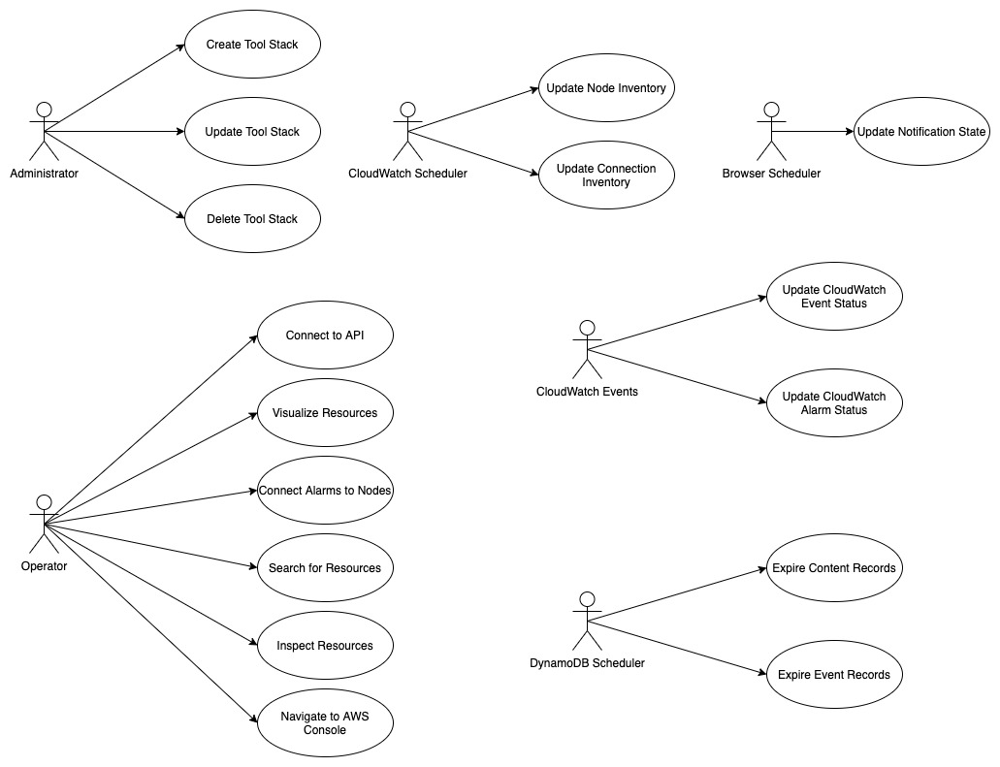
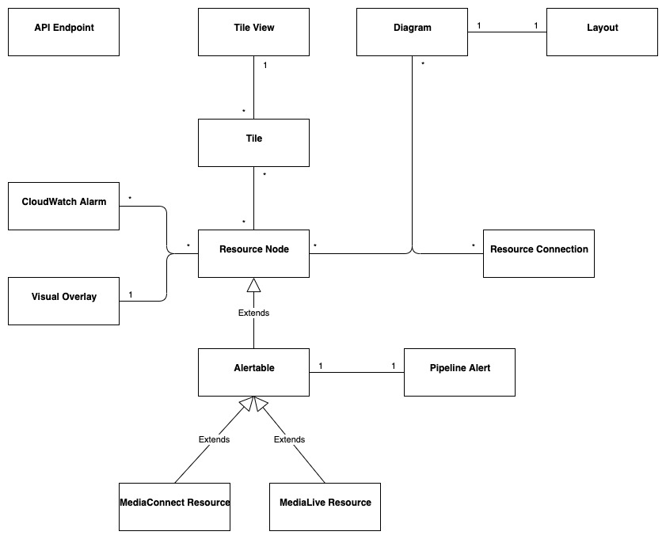
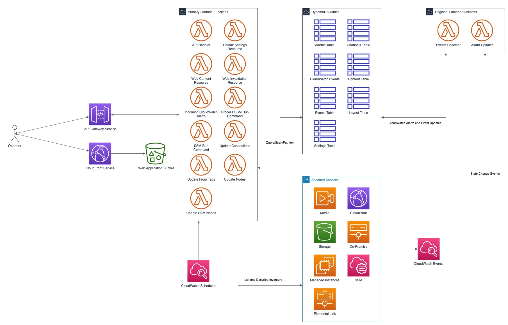

# MSAM Software Architecture Views

## Views

This document describes the architectural views for the authentication solution used by the demo.aws web sites.
The views in this document are described using the The “4+1” View Model of Software Architecture. 
The views used in this document are:

1. use case view
2. logical view (E-R, types)
2. behavioral views (sequence diagrams)
3. deployment view (deployment artifacts to services)
4. physical view (deployed code, configured services, communication paths)

### Use Case View

#### Actors and Use Cases

**Administrator**

*Create Tool Stack*

1. The actor locates the required URLs for the MSAM CloudFormation templates
2. The actor decides which region in which to install the new stack
3. The actor launches the all-resources template to create a new MSAM stack in the chosen region

Postconditions: The stack is created.

*Update Tool Stack*

1. The actor locates the required URLs for the MSAM CloudFormation templates
2. The actor locates the existing stack in CloudFormation
3. The actor uses the all-resources template to update the MSAM stack in the chosen region

Postconditions: The stack is updated.

*Delete Tool Stack*

2. The actor locates the existing stack in CloudFormation
3. The actor chooses to delete the stack from the region
4. The stack is deleted

**Browser Scheduler**

*Update Notification State*

Preconditions: The use case starts when the specified timer interval has elapsed for an update

1. The system contacts the API endpoint and requests changes to node alerts
2. The 

**CloudWatch Events**

*Update CloudWatch Event Status*

*Update CloudWatch Alarm Status*

**CloudWatch Scheduler**

*Update Node Inventory*

*Update Connection Inventory*

**DynamoDB Scheduler**

*Expire Content Records*

*Expire Event Records*

**Operator**

*Connect to API*

*Visualize Resources*

*Connect Alarms to Nodes*

*Search for Resources*

*Inspect Resources*

*Navigate to AWS Console*

### Logical View

The elements in this view represent the types (and terminology) of the problem space.

### Deployment View

### Physical View

### Behavioral Views

